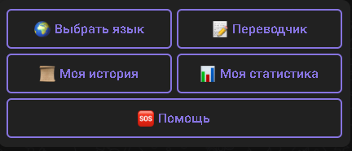
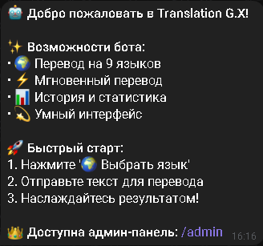
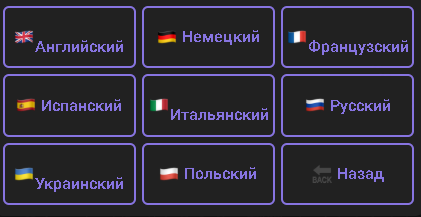
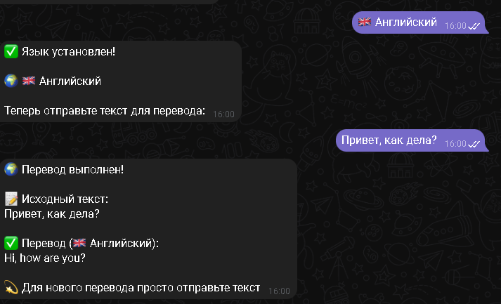
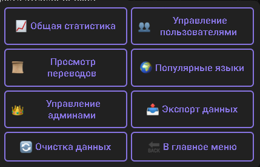
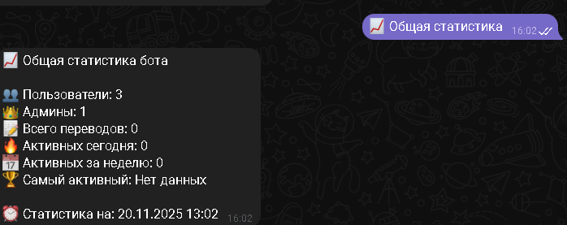
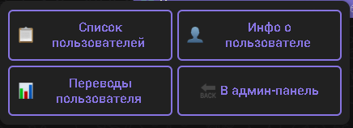

# 🤖 TELEGRAM TRANSLATION BOT

<div align="center">

[](https://python.org)
[](https://telegram.org)
[](https://sqlite.org)
[](LICENSE)

**🚀 БОТ-ПЕРЕВОДЧИК С АДМИН-ПАНЕЛЬЮ И СТАТИСТИКОЙ 🚀**

*Профессиональный переводчик с поддержкой 8 языков и расширенной админ-панелью*

</div>

---

## 📸 **ГАЛЕРЕЯ СКРИНШОТОВ**

<div align="center">

### **🎯 ОСНОВНОЙ ФУНКЦИОНАЛ БОТА**

<table>
  <tr>
    <td align="center"><strong>Главное меню</strong><br><br>Интуитивное управление</td>
    <td align="center"><strong>Приветствие</strong><br><br>Добро пожаловать в бот</td>
    <td align="center"><strong>Выбор языка</strong><br><br>Поддержка 8+ языков</td>
  </tr>
  <tr>
    <td align="center"><strong>Процесс перевода</strong><br><br>Мгновенный перевод</td>
    <td align="center"><strong>Админ-панель</strong><br><br>Центр управления</td>
    <td align="center"><strong>Статистика</strong><br><br>Детальная аналитика</td>
  </tr>
  <tr>
    <td align="center" colspan="3"><strong>Управление пользователями</strong><br><br>Контроль пользователей</td>
  </tr>
</table>

</div>

---

## ✨ **ВОЗМОЖНОСТИ И ФУНКЦИОНАЛ**

### 🌍 **ДЛЯ ПОЛЬЗОВАТЕЛЕЙ:**
- **🤖 Мгновенный перевод** на 8 языков с автоопределением исходного языка
- **📊 Личная статистика** использования с отслеживанием прогресса и истории переводов
- **⚡ Интуитивный интерфейс** с удобными кнопками и быстрым доступом ко всем функциям
- **🔍 История переводов** с возможностью просмотра последних запросов и результатов
- **🎯 Умный выбор языка** с поддержкой английского, немецкого, французского, испанского, итальянского, русского, украинского, польского и многих других

### 👑 **ДЛЯ АДМИНИСТРАТОРОВ:**
- **📈 Полная статистика** по всем пользователям, переводам и активности в реальном времени
- **👥 Управление пользователями** с просмотром информации, истории переводов и детальной аналитикой
- **💾 Экспорт данных** в популярных форматах JSON и CSV для дальнейшего анализа
- **🔄 Гибкая очистка** истории переводов с настройкой периодов и фильтрацией данных
- **⚙️ Управление правами** администраторов с возможностью добавления и удаления админов
- **🌍 Аналитика языков** с определением самых популярных направлений перевода

---

## 🚀 **БЫСТРЫЙ СТАРТ И УСТАНОВКА**

### **1. КЛОНИРОВАНИЕ РЕПОЗИТОРИЯ**
```bash
git clone https://github.com/your-username/telegram-translation-bot.git
cd telegram-translation-bot